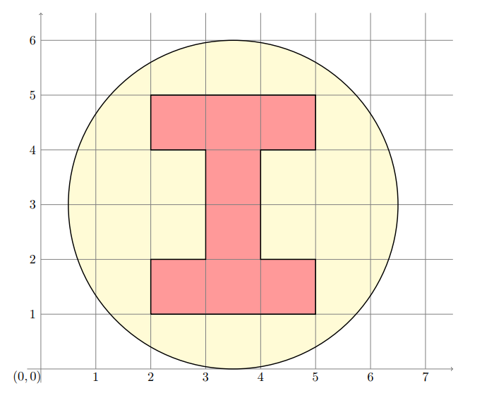

# Cancer Radiology Optimization (Tomotherapy)

This Project deals with Python Implementation of the Paper [Optimizing the Delivery of Radiation Therapy to Cancer Patients by David M Sheperd et. al. 1999](https://doi.org/10.1137/S0036144598342032) and then solving the problem given below using the Optimization Technique described in the above paper.
The Radiotherapy technique described in the above paper is also called as ***Tomotherapy***  
[AMPL API](https://github.com/ampl/amplpy) was used for optimization routine. Two different optimization models were written.[[1]](https://github.com/dumbPy/radiology_optimization/blob/master/models/model.mod)[[2]](https://github.com/dumbPy/radiology_optimization/blob/master/models/model_linear_norm.mod).  
Suppose we want to design an IMRT setup to obtain a dose corresponding to the following figure  
  
Assume that we want to achieve close to 10 units of radiation in the red region (denoting a tumor) and be as much below 4 units as possible in the remaining portion. You may assume the radiation intensity diminishes to half every 4 units (which means that this relation is not linear).  
Assuming that each beam is 1 unit wide, find a suitable configuration of beam weights and angles that can realize a plan as close as possible to the desired treatment. You may further assume that each beam is composed of 20 small beamlets each of whose intensities can be controlled separately.  
Solve one of the LPs or QPs proposed described by Shephard et al and find the optimal configuration. Describe the configuration in a readable manner. Also draw a pictorial representation of the intensity pattern achieved by your proposed solution. Comment on its quality. Clearly state all your assumptions and choices of parameters.  
# Notebook Implementation
2 Different Jupyter Note Implementations have been tried as below.

* [No Hard Cap](https://github.com/dumbPy/radiology_optimization/blob/master/tomotherapy_no_hard_cap.ipynb) - This Implementation uses 1st model above. It puts no cap on how much the radiation can reach in tumour region  
* [Linearized Norm Error](https://github.com/dumbPy/radiology_optimization/blob/master/tomotherapy_with_linearized_norm_error.ipynb) - This Implementation uses 2nd model above and is more closer to the optimization equation discussed in paper. It reduces `|error|` and hence tries to keep radiation in tumor region near the desired dosage level of 10

Python `.py` scripts are also available [here](https://github.com/dumbPy/radiology_optimization/tree/master/python%20scripts)

